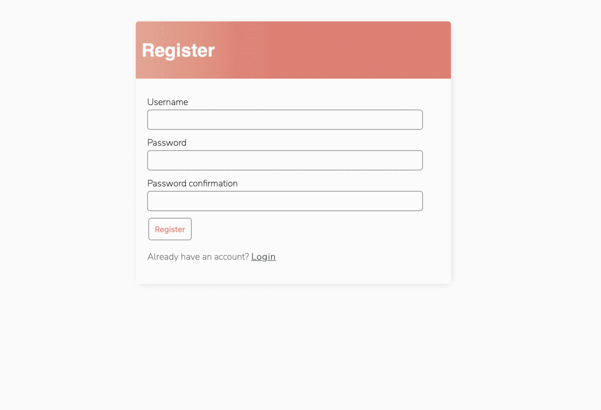

# todolist

<!--

-->

`todolist` is a web application that allows users to register themselves and then lets them maintain their To Do list.

### Project Objective

+ To learn about web application development using Django

### What Did I Learn?

+ CRUD operations (Create Task, Read Task, Update Task and Delete Task)
+ Login and Authentication (Registering a new user, Displaying filtered tasks to the logged in user)

### Future Changes

+ Add Heruko hosted live demo
+ Improve comments
+ Improve variable names
